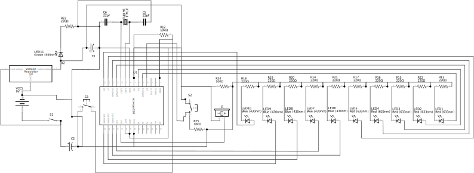
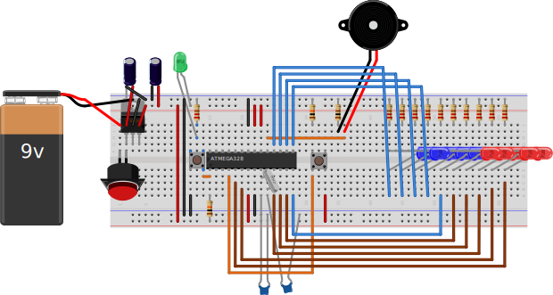

#### ArduinoSiren
A police / ambulance siren using Arduino

* A fork of [Siren-Code-Arduino](https://github.com/jigneshk5/Siren-Code-Arduino) by jigneshk5.

### Instructions
Original instructable can be found here: https://www.instructables.com/id/How-to-Make-a-Siren-Using-Arduino/

#### Building an Arduino on a Breadboard
Instructions to setup ATMEGA328P on a breadboard can be found here: https://www.arduino.cc/en/Main/Standalone

#### Schematic

#### Breadboard Layout
* This is how I have setup ArduinoClock on a breadboard.

#### Pictures
* [LED Chaser](https://www.instagram.com/p/ByKOTkWgI8r/)
* [LED Chaser](https://www.instagram.com/p/ByKO85dgSk9/)
